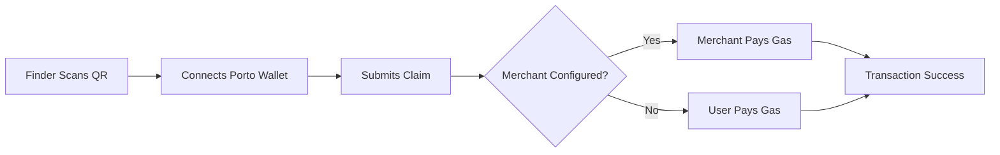

# Porto Integration - Gas-Free Lost & Found

## ✅ Complete Implementation Status

Nostos now fully implements Porto's transaction sponsoring as per https://porto.sh/sdk/guides/sponsoring, enabling users with **zero crypto experience** to return lost items.

## 🎯 What We've Implemented

### 1. **Porto Connector Configuration** ✅
- Porto connector properly configured in `/lib/porto-config.ts`
- Merchant RPC URL dynamically set based on environment
- Supports Sepolia, Base Sepolia, and Mainnet

### 2. **Merchant RPC Endpoint** ✅
- Located at `/api/rpc/route.ts` (following Porto naming convention)
- Uses `MerchantRpc.requestHandler()` from Porto SDK
- Custom sponsorship logic for specific functions

### 3. **Sponsored Transactions** ✅
**ONLY submitClaim is sponsored** - making it completely FREE for good samaritans to return lost items:
- **submitClaim**: ✅ Finders can claim items without any ETH (SPONSORED)
- **revealContactInfo**: ❌ Owners pay gas to reveal contact (NOT SPONSORED)
- **confirmReturn**: ❌ Owners pay gas to confirm returns (NOT SPONSORED)

This design ensures finders (who are doing a good deed) never need ETH, while owners (who get their items back) handle the small gas costs for their actions.

### 4. **Auto-Connect Experience** ✅
- Register page prompts wallet connection if not connected
- Found/Claim page emphasizes FREE transactions with Porto
- Clear messaging about gas-free experience

## 🚀 How It Works for Non-Crypto Users

1. **User finds a lost item** with Nostos QR code
2. **Scans QR or enters item ID** on the Found page
3. **Clicks "Connect Wallet"** - Porto is prioritized
4. **Signs in with passkey/email** - no seed phrases!
5. **Submits claim for FREE** - merchant pays gas
6. **Gets reward** when owner confirms return

## 📋 Setup Instructions

### Quick Setup
```bash
./setup-porto-sponsor.sh
```

### Manual Setup
1. **Create Merchant Account**
   ```bash
   pnpx porto onboard -a
   ```

2. **Configure Environment**
   Add to `.env.local`:
   ```env
   MERCHANT_ADDRESS=0x...
   MERCHANT_PRIVATE_KEY=0x...
   ```

3. **Fund Merchant Account**
   - Sepolia: https://sepoliafaucet.com
   - Base Sepolia: https://docs.base.org/docs/tools/faucets

## 🔍 Key Implementation Files

- **Porto Config**: `/lib/porto-config.ts`
  - Configures Porto connector with merchant RPC URL
  - Supports multiple chains

- **RPC Endpoint**: `/api/rpc/route.ts`
  - Implements merchant RPC handler
  - Custom sponsorship logic

- **User Components**:
  - `/components/ClaimForm.tsx` - Gas-free claiming UI
  - `/components/ItemRegistration.tsx` - Auto-connect for owners

## 💡 Benefits for Users

### For Finders (Good Samaritans)
- ✅ No wallet needed initially
- ✅ No ETH required ever
- ✅ No seed phrases to manage
- ✅ Simple email/passkey login
- ✅ Completely FREE to return items

### For Owners
- ✅ More items returned (lower barrier)
- ✅ Wider audience can help
- ✅ Still secure with blockchain

## 🧪 Testing the Integration

1. **Without Merchant Config** (fallback mode):
   - Porto works but users pay their own gas
   - Still better UX than MetaMask

2. **With Merchant Config** (sponsored mode):
   - Completely gas-free for finders
   - Merchant account pays all fees
   - True web2-like experience

## 📊 Transaction Flow



## 🔐 Security Notes

- Merchant private key only on server
- Sponsorship logic validates transactions
- Only specific functions are sponsored
- Chain validation prevents abuse

## 📈 Future Improvements

- [ ] Add spending limits per user
- [ ] Analytics for sponsored transactions
- [ ] Support for more chains
- [ ] Dynamic sponsorship rules

## 📚 Resources

- [Porto Sponsoring Guide](https://porto.sh/sdk/guides/sponsoring)
- [Porto SDK Documentation](https://porto.sh/sdk)
- [Porto Dashboard](https://porto.sh/dashboard)

---

**Result**: Nostos fully implements Porto's transaction sponsoring, enabling truly gas-free returns of lost items for users with zero crypto experience. The system gracefully falls back to user-paid transactions if sponsoring isn't configured.